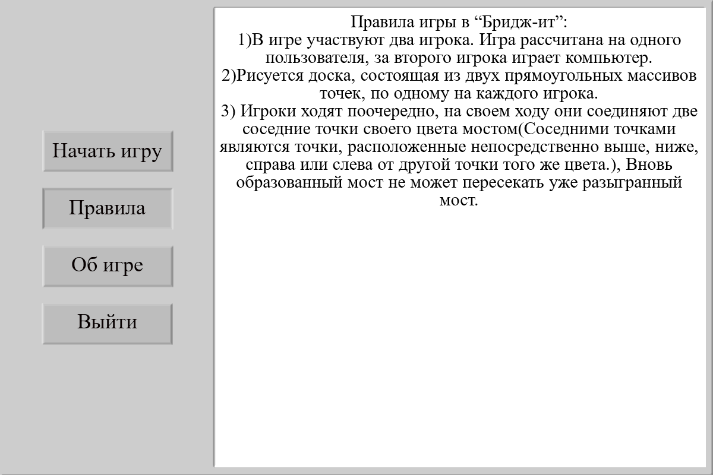

# [Игра "Бридж-Ит"](https://ru.wikipedia.org/wiki/%D0%9F%D0%B5%D1%80%D0%B5%D0%B1%D1%80%D0%BE%D1%81%D1%8C_%D0%BC%D0%BE%D1%81%D1%82%D0%B8%D0%BA)
## Правила игры
- В игре участвуют два игрока. Игра рассчитана на одного пользователя, за второго игрока играет компьютер. 
- Рисуется доска, состоящая из двух прямоугольных массивов точек, по одному на каждого игрока. 
- Игроки ходят поочередно, на своем ходу они соединяют две соседние точки своего цвета мостом (соседними точками являются точки, расположенные непосредственно выше, ниже, справа или слева от другой точки того же цвета.), вновь образованный мост не может пересекать уже разыгранный мост.
Условия победы просты - необходимо первым создать цепь мостов, которая соединяет противоположные края доски
## Скриншоты графического интерфейса
#### Меню

#### Окно игры

#### Правила

#### Об игре
